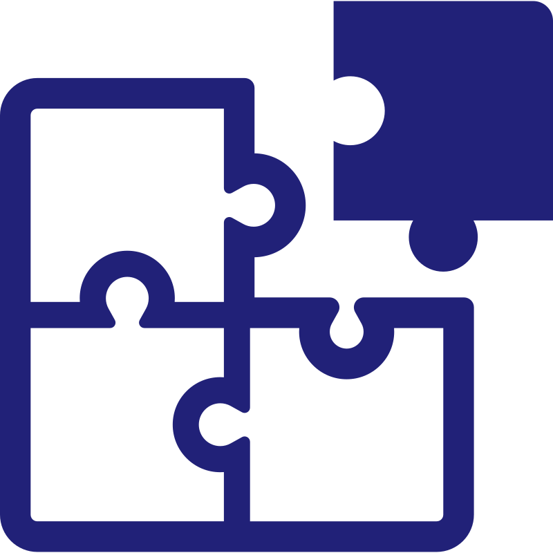

<div align="center">
  <picture>
    
  </picture>
<br>

<h2>Omni-NLI</h2>

[](https://github.com/CogitatorTech/omni-nli/actions/workflows/tests.yml)
[](https://codecov.io/gh/CogitatorTech/omni-nli)
[](https://github.com/CogitatorTech/omni-nli)
[](https://pypi.org/project/omni-nli/)
[](https://github.com/CogitatorTech/omni-nli/blob/main/LICENSE)

A multi-interface (REST and MCP) server for natural language inference

</div>

---

Omni-NLI is a self-hostable server that provides natural language inference (NLI) capabilities via a REST API and the Model Context Protocol (MCP).
It can be used both as a very scalable standalone microservice and also as an MCP server for AI agents to implement a verification layer for AI-based
applications.

### What is NLI?

Given two pieces of text called premise (or fact) and hypothesis (or claim), NLI is the task of determining the relationship between them.
The relationship is typically shown by one of three labels:

- `"entailment"`: the hypothesis is supported or proved by the premise
- `"contradiction"`: the hypothesis is refuted or contradicts the premise
- `"neutral"`: the hypothesis is neither supported nor refuted by the premise

NLI is useful for a lot of applications, like fact-checking the output of large language models (LLMs) and checking the correctness of the answers a
question-answering system generates.

### Features

- Supports models provided by different backends, including Ollama, HuggingFace, and OpenRouter
- Supports REST API (for traditional applications) and MCP (for AI agents) interfaces
- Fully configurable and very scalable

See [ROADMAP.md](ROADMAP.md) for the list of implemented and planned features.

> [!IMPORTANT]
> Omni-NLI is in early development, so bugs and breaking changes are expected.
> Please use the [issues page](https://github.com/CogitatorTech/omni-nli/issues) to report bugs or request features.

---

### Quickstart

#### 1. Installation

```sh
pip install omni-nli
```

#### 2. Configure Backends

Copy the example config and add your API keys:

```sh
cp .env.example .env
# Edit .env to configure the model backends and other settings
```

#### 3. Start the Server

```sh
omni-nli
```

The server will be listening on `http://127.0.0.1:8000` by default.

#### 4. Evaluate NLI

```sh
curl -X POST \
  -H "Content-Type: application/json" \
  -d '{
    "premise": "A soccer player kicks a ball into the goal.",
    "hypothesis": "The soccer player is asleep on the field."
  }' \
  http://127.0.0.1:8000/api/v1/tools/evaluate_nli/invoke
```

Response:

```json
{
    "content": [
        {
            "type": "json",
            "data": {
                "label": "contradiction",
                "confidence": 1.0,
                "thinking_trace": null,
                "usage": {
                    "total_tokens": 188,
                    "thinking_tokens": 0,
                    "prompt_tokens": 172,
                    "completion_tokens": 16
                },
                "model": "Qwen/Qwen2.5-1.5B-Instruct",
                "backend": "huggingface"
            }
        }
    ]
}
```

---

### Documentation

Check out the [Omni-NLI Documentation](https://cogitatortech.github.io/omni-nli/) for more information, including configuration options, API
reference, and examples.

---

### Contributing

Contributions are always welcome!
Please see [CONTRIBUTING.md](CONTRIBUTING.md) for details on how to get started.

### License

Omni-NLI is licensed under the MIT License (see [LICENSE](LICENSE)).

### Acknowledgements

- The logo is from [SVG Repo](https://www.svgrepo.com/svg/480613/puzzle-9) with some modifications.
